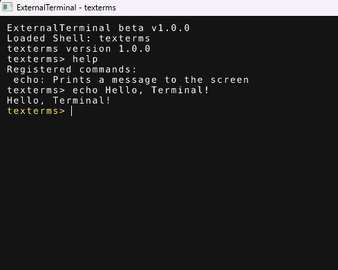

# ExternalTerminal
Terminal interface for C++ applications via Lua shells.

## Overview
ExternalTerminal is a lightweight C++ terminal interface designed to allow Lua scripts to communicate with and control other programs.

The terminal acts as an interactive middle layer where Lua scripts—called **shells**—define user-executable commands that can modify the behavior of any program that integrates the API.

## Features
- Embedded Lua scripting support
- Extend applications with custom Lua shells
- Command-line terminal interface
- Lightweight and easy to integrate

## What is a Lua Shell?
A **Lua shell** is a Lua script that provides commands that users can execute within the terminal interface.

These commands can be used for tasks such as:

- Sending input to another program
- Automating tasks in another program
- Providing a developer console for debugging, errors, and warnings

## Screenshots


## Installation

### Requirements
- CMake 3.31+
- C++20 compatible compiler

### Build
```bash
git clone https://github.com/timurg24/externalterminal.git
cd externalterminal
mkdir out
cd out
cmake ..
make
```